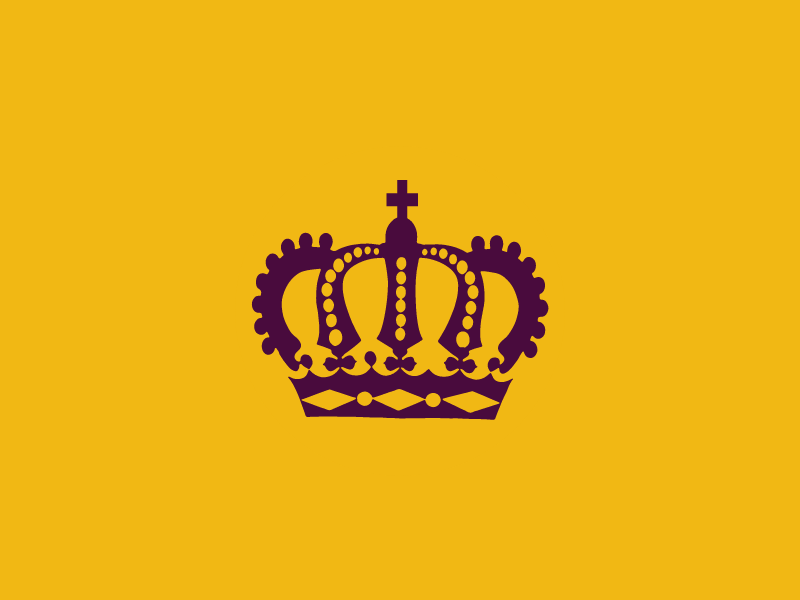

# Royal Robot Reviews

This website has been created for users to write reviews for a selection of games and compare their scores.

The live site can be found [here](https://royal-robot-reviews.herokuapp.com/)

## Table of Contents

* [User Experience](#user-experience)

    * [User stories](#user-stories)
    * [Admin Stories](#admin-stories)

* [Planning](#planning)

* [Features](#features)

* [Future Features](#future-features)

* [Django apps and models](#django-apps-and-models)

* [Testing](#testing)

* [Languages and Programs Used](#languages-and-programs-used)

    * [Languages](#languages)

    * [Libraries and Frameworks](#libraries-and-frameworks)

    * [Development tools](#development-tools)

    * [Required modules](#required-modules)

* [Credits](#credits)

## User Experience

### User stories

As a user I would like to be able to...

### Admin Stories

As an admin I would like to be able to...

## Planning

* Colour Scheme
    * Simple black and yellow colours for most of site and purple for logo to represent royalty
    * contrsating colours for easy legiblity and style

* Font taken from [Google Fonts](https://fonts.google.com/)

* Pages were planned out on [Figma](https://www.figma.com) using wireframes

## Features

* Logo
    * The logo was made using [Canva](canva.com)
    * Used as link to return to the home page
    * Logo uses purple to represent royalty

* Base Template

    * Header with navigation bar
    * Footer with social media links

* Index Page
    * Introduction telling you about the site and what to do
    * List of Games to choose
    * Paginated if above 6 games
    * Games ordered by average review scores
    * Images, titles, scores and developer shown on each game card

* Game Detail Page

    * Game detail with average review score and description
    * Game reviews with the ability for user's to edit and delete their own reviews
    * Review Form with stars that reflect the users rating

* Edit Review Page

    * Will fill the textarea with the review of that instance

* Delete Modal

    * An 'are you sure?' modal to prevent users from accidentaly deleting

### Future Features

* Users can add games

## Django apps and models

## Testing

### HTML

* Tested using the official [W3C Validator](https://validator.w3.org/nu/?doc=https%3A%2F%2Froyal-robot-reviews.herokuapp.com%2F)

### CSS

* Tested using the official [Jigsaw W3C Validator](https://jigsaw.w3.org/css-validator/validator)

### JavaScript

* Tested using [JSHint JavaScript Validator](https://jshint.com/)

### Browsers

* Tested on Google Chrome and Microsoft Edge

### Responsiveness

* Tested responsiveness on Phone, Tablet and Desktop
*

### Accessibility

* Tested using a web accessibility evaluation tool called [Wave](https://wave.webaim.org/)
* Semantic HTML is used
* Headers are in order and not skipped (h1, h2, h3)

## Bugs and Solutions

## Languages and Programs Used

### Languages

* HTML5 for site structure
* CSS3 for styling
* JavaScript for star ratings and message timeouts
* Python 3.0 for Django

### Libraries and Frameworks

* [Django](https://www.djangoproject.com/)'s model view template structure was used to create apps and run them
* [Boostrap4](https://getbootstrap.com/docs/4.5/getting-started/introduction/) framework used for responsive styling and templates

### Development tools
* Git for version control
* VS Code as IDE (integrated development environment)
* PIP to install packages
* Postgresql for the database to create content and manage data

### Required modules

All modules required are located in the [requirements.txt](requirements.txt) file.

## Credits

* [Bootstrap cheatsheet](https://hackerthemes.com/bootstrap-cheatsheet/) helped by listing boostrap classes in an easy to find manner
* [Boostrap Templates and Examples](https://getbootstrap.com/docs/5.1/examples/) used as a basis for some features
* [Font Awesome](https://fontawesome.com/) used for the stars
* [W3Schools](https://www.w3schools.com/) used for reference in using coding [languages](#languages)
* [Stack Overflow](https://stackoverflow.com/) was used to find solution to some coding issues
* The [Code Institute](https://codeinstitute.net/) study material was used
* [Wikipedia](https://www.wikipedia.org/) used for descriptions of the games